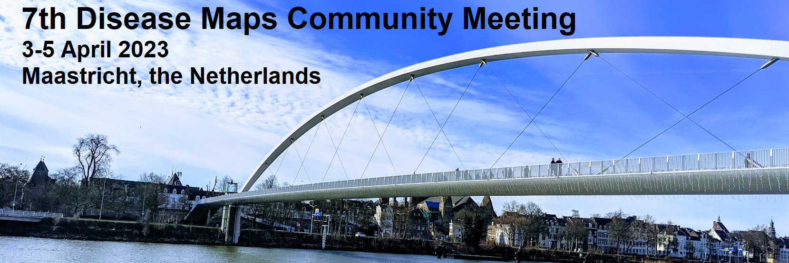

The 2023 community meeting is hosted at <a target="_blank" href="https://www.maastrichtuniversity.nl/">Maastricht University</a>  by the Maastricht Centre for Systems Biology (MaCSBio) and the Department of Bioinformatics (BiGCaT).

## Date / Location

The 7th Disease Map Community Meeting will take place from **3-5 April 2023 in Maastricht**, the Netherlands

## Abstract submission

<strong>The abstract submission will open soon.</strong>

## Registration

<strong>The registration will open soon.</strong>

## Invited speakers

<table>
  <tr>
    <td style="width: 220px;">
<strong>TBA</strong>

</td>
    <td style="width: 220px;">
<strong>TBA</strong>

</td>
  </tr>
  <tr>
    <td style="width: 220px;">
<strong>TBA</strong>

</td>
    <td style="width: 220px;">
<strong>TBA</strong>

</td>
  </tr>
</table>

## Programme

The time is shown for Amsterdam: Central European Time (CET) &ndash; **UTC/GMT +1 hour**. 

### Day 1 (3 April 2023)
---
 **<a target="_blank" href="https://dateful.com/time-zone-converter?t=08:30&tz=Amsterdam">08:30</a> Welcome and registration**
  
  **<a target="_blank" href="https://dateful.com/time-zone-converter?t=09:00&tz=Amsterdam">09:00</a> Introductory remark**
	 _Martina Summer-Kutmon, Maastricht University, Maastricht, Netherlands_

### Day 2 (4 April 2023)
 
---

### Day 3 (5 April 2023)

---

 

## Organisers

### Local organisers

<a href="mailto:martina.kutmon@maastrichtuniversity.nl">Martina Summer-Kutmon</a>  
 Chris Evelo
 Ilja Arts

### Disease Maps Project Coordinators

<a href="mailto:a.mazein@gmail.com">Alexander Mazein</a>
 <a href="mailto:marek.ostaszewski@uni.lu">Marek Ostaszewski</a>
 <a href="mailto:inna.kuperstein@curie.fr">Inna Kuperstein</a>
 <a href="mailto:anna.niaraki@univ-evry.fr">Anna Niarakis</a>
 <a href="mailto:andrei.zinovyev@curie.fr">Andrei Zinovyev</a>
 <a href="mailto:reinhard.schneider@uni.lu">Reinhard Schneider</a>
 <a href="mailto:emmanuel.barillot@curie.fr ">Emmanuel Barillot</a>
 <a href="mailto:rudi.balling@uni.lu">Rudi Balling</a>
 <a href="mailto:cauffray@eisbm.org">Charles Auffray</a>

<!--## Contact-->

<!--## Co-organizers-->
